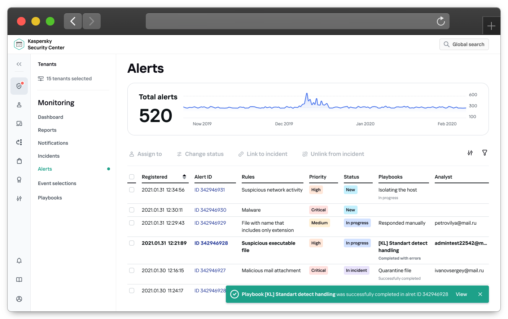
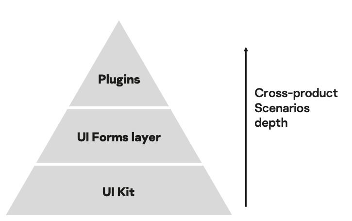
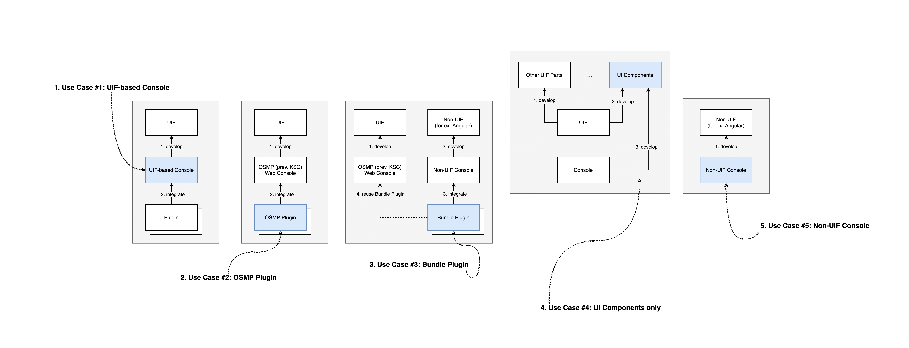
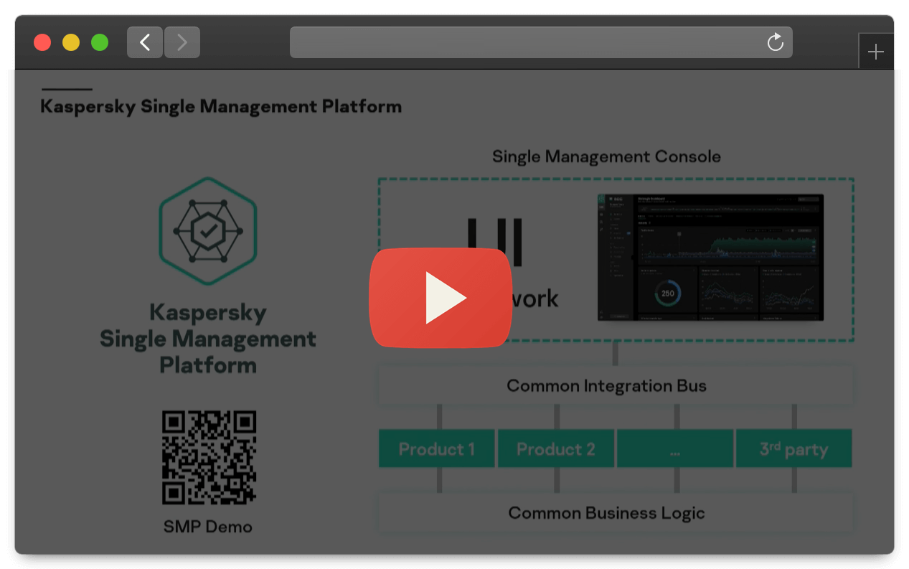

# UIF — web starter toolset

An opinionated toolset to build UI and Web Services like so:

## Quick Links

1. Storybook: https://kasperskylab.github.io/uif/hexa-ui/
2. Examples -> Quick Start: [code](./examples/quick-start/), [demo](https://kasperskylab.github.io/uif/examples/quick-start/)

Currently available:

* [@kaspersky/hexa-ui](./packages/kaspersky-hexa-ui/) — Hexa UI, Kaspersky Design System
* [@kaspersky/hexa-ui-icons](./packages/kaspersky-hexa-ui-icons/) — Hexa UI icon pack
* [@kaspersky/hexa-ui-icons](./packages/kaspersky-hexa-ui-core/) — Hexa UI design tokens
* [@kaspersky/ui-builder](./packages/kaspersky-ui-builder/) — WYSIWYG editor to create HTML forms
* [@kaspersky/runtime](./packages/kaspersky-runtime/) — Application Bus
* [@kaspersky/dev-tools](./packages/kaspersky-dev-tools/) — Set of configs for ESLint, Babel, TypeScript

## What? Why? How?

### What is UIF

UIF is a technology platform for building user interfaces and web services.

### Key benefits

UIF allows you to:
- reduce time-to-market
- reduce the development costs
- improve the quality of the products being developed

Due to what is this happening? Quite simply, UIF provides:

- up-to-date styles from Kaspersky Design System
- unification of approaches to standard solutions and code base
- singe "point of truth" to answer technical questions
- reuse of accumulated expertise in each product

## How UIF works

UIF consists of 3 parts:

1. UI Kit
2. HTML Forms Management
3. Plugin architecture (Micro Frontends)

UIF has 3 main usage scenarios:

1. UIF-based Console — Standalone UI
2. Plugin — Micro Frontend
3. UI Components only — UI Kit

## Kaspersky Open Single Management Platform

UIF is a part of XDR platform Kaspersky Open Single Management Platform.

Kaspersky OSMP is used to build Kaspersky Ecosystem.

Open Single Management Platform includes:
- Incident Response Platform
- SIEM
- Endpoint and Non-Enpoint Protection
- Asset Management
- Log management
- IAM
- Communication Platform
- Integration Platform

Detailed presentation of Kaspersky OSMP from Anton Ivanov, Kaspersky CTO: [https://www.youtube.com/watch?v=GLOqZh0zTfg](https://www.youtube.com/watch?v=GLOqZh0zTfg)

