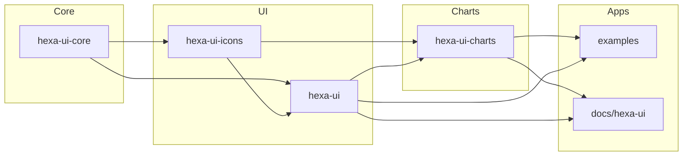

# Hexa UI Monorepo

**Purpose:** Specification (single source of truth) for the Hexa UI monorepo layout, tooling, and release process. One version for all hexa-* packages, CI-only publish, npm as the only package manager.

**Goals:** One version for all hexa-* (fixed group); release only via CI on `master`; bump type from conventional commits; developers have no publish rights. **Non-goals:** Full monorepo guide; specific CI YAML or commitlint rule set; branch policy beyond `master` for release.

**Boundaries:** This spec defines repo structure, root config (workspaces, Turborepo, Changesets, commitlint, Husky, lint-staged), the three scenarios, and roles. It does not define exact CI job steps, commitlint config contents, or npm registry details.

---

## Quick Start

Three scenarios — pick the one that matches your situation. For detailed commands see [Commands](#commands).

- **Scenario 1: Local Dev** — edit a package, `npm install`, `npm run build` or `npm run dev`. No publish.
- **Scenario 2: Release on CI** — commit (conventional message) and push. CI builds, bumps versions, and publishes. Developers have no publish rights.
- **Scenario 3: Use published** — set `@kaspersky/*` versions in `package.json`, run `npm install` (in repo or external app).

---

## How it works

This repo is one monorepo: Hexa UI libraries, two example apps, and the docs site. Structure:

```
uif/
├── package.json                  # workspaces, scripts (build, version, publish:packages, prepare)
├── turbo.json                    # tasks: build, dev, lint, test
├── .husky/
│   ├── pre-commit                # npx lint-staged
│   └── commit-msg                # npx commitlint --edit $1
├── .changeset/
│   └── config.json               # fixed: all hexa-* packages
├── packages/
│   ├── kaspersky-hexa-ui-core/
│   ├── kaspersky-hexa-ui-icons/
│   ├── kaspersky-hexa-ui/
│   └── kaspersky-hexa-ui-charts/
├── examples/
│   ├── quick-start/
│   └── next-js/
└── docs/
    └── hexa-ui/
```

### Concepts

- **Package** — a hexa-* library (hexa-ui-core, hexa-ui-icons, hexa-ui, hexa-ui-charts).
- **Fixed group** — all hexa-* always share one version (`.changeset/config.json`).
- **Changeset** — file created by a custom automation script (hook or CI) from a conventional commit; describes bump type.
- **Release branch** — `master`; CI runs version + publish there.
- **Workspace** — repo root; examples and docs consume packages via npm workspaces or pinned versions.

---

## Deep dive

### Tooling

| Layer | Tool | Role |
|-------|------|------|
| Package manager | npm | The only package manager in this repo. All commands use `npm`. |
| Workspace | npm workspaces | Links local packages on `npm install`; no publish for local dev. |
| Tasks | Turborepo | Build in dependency order; local cache. |
| Git hooks | [Husky](https://typicode.github.io/husky/) v9 | Runs Git hooks via shell scripts in `.husky/`: **pre-commit** → lint-staged; **commit-msg** → commitlint. Initialized with `npx husky init`; `prepare` script in `package.json` ensures hooks are installed on `npm install`. |
| Commit format | [Conventional Commits](https://www.conventionalcommits.org/) | `type(scope): description`. Types: `fix` (patch), `feat` (minor), `feat!`/`fix!` (major), `chore: [NO_CI] ...` (no release). |
| Commit validation | [commitlint](https://commitlint.js.org/) (via Husky commit-msg) | Validates message format; avoids invalid commits and wrong bumps. |
| Pre-commit checks | [lint-staged](https://github.com/okonet/lint-staged) (via Husky pre-commit) | Runs lint/format on staged files before commit. |
| Version & release | [Changesets](https://github.com/changesets/changesets) | Bump versions, update dependents, publish; **fixed** = one version for all hexa-*. Only CI runs version + publish. |
| Changelog | Changesets (conventional) | Generated from changeset files; format follows conventional commits. |
| Release automation | CI robot | On `master`: build, create changesets (if not done by hook), `changeset version`, `npm install`, `changeset publish`. Holds npm credentials; skips when `[NO_CI]`. |

### Package graph



*hexa-ui-charts* also depends on *hexa-ui-core* (via hexa-ui); omitted for clarity. Examples and docs are not published.

### Conventional commits & CI

Only release path: no manual `npx changeset` or publish by developers. Bump type is inferred from the commit message. A custom automation script (commit-msg hook or CI job) creates a changeset file from the message and changed files; affected packages are the fixed group (all hexa-*). This script bridges conventional commits and Changesets and must be implemented for this repo.

| Commit message | Bump | Example |
|----------------|------|---------|
| `fix: ...` | Patch | `fix: button color in theme` |
| `feat: ...` | Minor | `feat: add Tooltip delay prop` |
| `feat!: ...` or `fix!: ...` | Major | `feat!: remove deprecated size prop` |
| `chore: [NO_CI] ...` | None (skip release) | `chore: [NO_CI] update readme` |

**Roles:**

- *Developer* — commits and pushes; no npm publish rights; on failure fixes message or config and pushes again.
- *CI (robot)* — on `master`: build → `changeset version` → `npm install` → `changeset publish`; holds registry credentials; on failure re-run pipeline or fix config.

**Release flow:** Commit (conventional) → hook or CI creates changeset file → push to `master` → CI: build → `changeset version` → `npm install` → `changeset publish` → packages in registry (one version for all hexa-*).

**Failures and recovery:**

- *Commitlint rejects message* — fix message and amend or new commit.
- *No changeset file when CI runs* — CI will not bump/publish; ensure hook or CI script creates changeset from commit.
- *CI fails on version or publish* — fix error (e.g. registry auth, version conflict), re-run pipeline.

### Config

Config supports the scenarios and tooling above. *Required:* workspaces, `scripts.build`, `scripts.dev`; `.changeset/config.json` with `fixed` listing all hexa-*; Husky + commitlint (commit-msg). *Optional:* `scripts.version` / `publish:packages` (CI only); lint-staged (pre-commit).

Root config files:

1. **package.json** — workspaces, scripts (`build`, `dev`, `version`, `publish:packages`, `prepare`).
2. **turbo.json** — task order and cache.
3. **.changeset/config.json** — fixed group (all hexa-*) and dependent bump behaviour.
4. **.commitlintrc** — conventional commit types and rules; used by commitlint in the commit-msg hook.
5. **.husky/** — directory with hook scripts: `.husky/pre-commit` (runs lint-staged), `.husky/commit-msg` (runs commitlint). Created by `npx husky init`.
6. **lint-staged config** — in `package.json` under `"lint-staged"` or in `.lintstagedrc`; commands for staged files on pre-commit.

You also need a **custom automation script** (commit-msg hook or CI job) that creates a changeset file from the conventional commit message and changed files (commits with `[NO_CI]` must not create a changeset). This script is not provided by Changesets and must be written specifically for this repo. Message format validation is covered by commitlint (item 4). The `publish:packages` script assumes changeset files already exist.

Below is the minimal shape of the main config files.

**Root `package.json`:**

```json
{
  "private": true,
  "workspaces": [
    "packages/*",
    "examples/quick-start",
    "examples/next-js",
    "docs/hexa-ui"
  ],
  "scripts": {
    "build": "turbo run build",
    "dev": "turbo run dev",
    "version": "changeset version",
    "publish:packages": "turbo run build && changeset version && npm install && changeset publish",
    "prepare": "husky"
  },
  "devDependencies": {
    "turbo": "...",
    "@changesets/cli": "...",
    "husky": "...",
    "commitlint": "...",
    "lint-staged": "..."
  }
}
```

**`turbo.json`:**

```json
{
  "tasks": {
    "build": { "dependsOn": ["^build"], "outputs": ["dist/**", ".next/**", "out/**"] },
    "dev": { "cache": false, "persistent": true },
    "lint": {},
    "test": { "dependsOn": ["build"] }
  }
}
```

**`.changeset/config.json`:**

```json
{
  "$schema": "https://unpkg.com/@changesets/config@3.0.0/schema.json",
  "changelog": "@changesets/cli/changelog",
  "commit": false,
  "fixed": [
    ["@kaspersky/hexa-ui-core", "@kaspersky/hexa-ui-icons", "@kaspersky/hexa-ui", "@kaspersky/hexa-ui-charts"]
  ],
  "access": "restricted",
  "updateInternalDependencies": "patch"
}
```

### Commands

The commit-msg hook runs automatically on `git commit` and validates the message (commitlint); no separate command.

**Scenario 1: Local Dev**

| Where | Command | Purpose |
|-------|---------|---------|
| Root | `npm install` | Link workspaces; examples/docs use local packages. |
| Root | `npm run build` | Build all in dependency order. |
| Root | `npm run dev` | Run examples or docs (e.g. `npm run dev --workspace=examples/next-js`). |

**Scenario 2: Release on CI** — developer runs `git commit` (conventional message) and `git push`; CI runs the rest.

| Where | Command | Purpose |
|-------|---------|---------|
| CI | `npm run build` | Build before release. |
| CI | `changeset version` then `npm install` | Bump versions, refresh lockfile. |
| CI | `changeset publish` | Publish to registry (developers have no publish rights). |

**Scenario 3: Use published**

| Where | Command | Purpose |
|-------|---------|---------|
| Examples/docs (in repo) | Edit `package.json` versions, then `npm install` at root | Pin to specific published versions. |
| External app | `npm update @kaspersky/hexa-ui ...` or edit package.json and `npm install` | Use new versions. |

### Setup checklist

Repo conforms to this spec when:

1. Root has `package.json` with workspaces, `scripts.build`, `scripts.dev`, and `scripts.prepare` (`husky`).
2. `turbo.json` defines tasks (build, dev, lint, test).
3. `.changeset/config.json` has `fixed` listing all hexa-* packages.
4. `.commitlintrc` exists with conventional commit rules.
5. `.husky/pre-commit` runs lint-staged; `.husky/commit-msg` runs commitlint.
6. A **custom automation script** (commit-msg hook or CI job) creates changeset files from conventional commits; `[NO_CI]` commits do not create a changeset. This script must be written and maintained — it is not provided by Changesets out of the box.
7. Scenario 1: `npm install` and `npm run build` (or `dev`) succeed.
8. Scenario 2: CI on `master` runs build, version, publish.
9. Scenario 3: examples/docs or external app can depend on published versions.

---

## References

- [Conventional Commits](https://www.conventionalcommits.org/)
- [Husky](https://typicode.github.io/husky/) — Git hooks (pre-commit → lint-staged, commit-msg → commitlint)
- [lint-staged](https://github.com/okonet/lint-staged) — run commands on staged files
- [commitlint](https://commitlint.js.org/) — validate commit message format
- [Changesets — fixed packages](https://github.com/changesets/changesets/blob/main/docs/fixed-packages.md)
- [vercel/turbo — examples/with-changesets](https://github.com/vercel/turbo/tree/main/examples/with-changesets)
- [vercel/turbo — examples/design-system](https://github.com/vercel/turbo/tree/main/examples/design-system)
