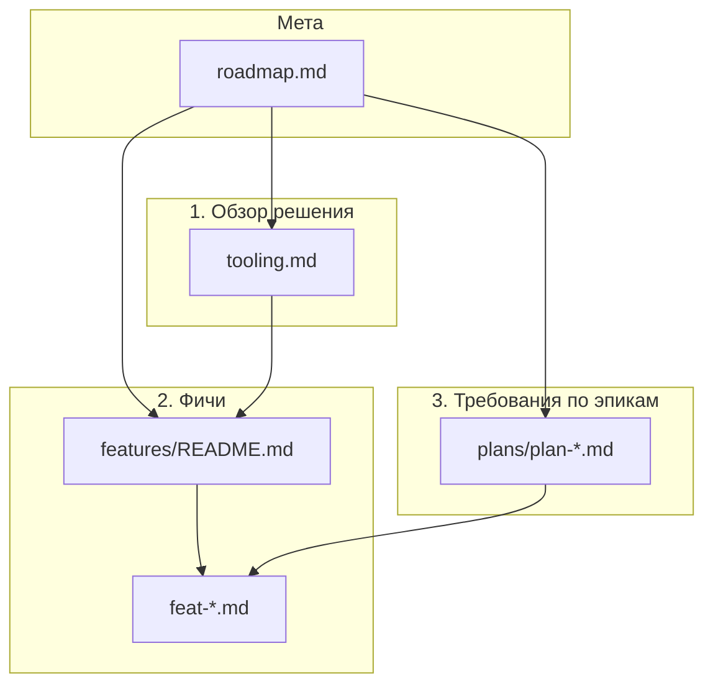

# Документация: UI Normalization

Spec-driven описание **config-driven** форм (редактор **normalization-tool**, просмотр **transpile-viewer**, общий DSL).

---

## Итоговый вид документации (три слоя)

| Слой | Документ | Назначение |
|------|----------|------------|
| **1** | **[tooling.md](./tooling.md)** | Краткое **описание решения** (что строим, зачем, как устроено в целом) и **таблица ссылок** на фичи. В конце файла — **прежние ссылки на разделы** (`#…`) для совместимости. |
| **2** | **[features/README.md](./features/README.md)** | **Дерево вложенных фич** и ссылки на файлы **`feat-*.md`**: контракты, ограничения, связь с кодом. |
| **3** | **[plans/](./plans/)** | **Требования** закрытых и текущих эпиков: таблица *`id` · фича · описание*; трассировка к роадмапу и к файлам из **`features/`**. |
| **Мета** | **[roadmap.md](./roadmap.md)** | Этапы **п.1–9**, статусы, указатели на слои 1–3. |

**Точка входа для чтения:** [tooling.md](./tooling.md) → при необходимости углубления — конкретный **`features/feat-…`** → для приёмки эпика — **`plans/plan-…`**.

**П.9 роадмапа** закрепляет поддержание этой структуры при эволюции кода.

---

## Быстрый указатель

| Тема | Куда |
|------|------|
| Два приложения, паритет, границы продукта | [feat-product-and-parity.md](./features/feat-product-and-parity.md) |
| `FormData`, дерево контролов | [feat-dsl-root-model.md](./features/feat-dsl-root-model.md) |
| `configHook` | [feat-config-hook.md](./features/feat-config-hook.md) |
| Sucrase, чанки, `loadFormDslBrowserRuntime` | [feat-lazy-dsl-runtime.md](./features/feat-lazy-dsl-runtime.md) |
| FSA, IndexedDB, `?form=` | [feat-workspace-browser.md](./features/feat-workspace-browser.md) |
| Button / Text / Grid / Table / DSL п.2 | [plans/](./plans/) |
