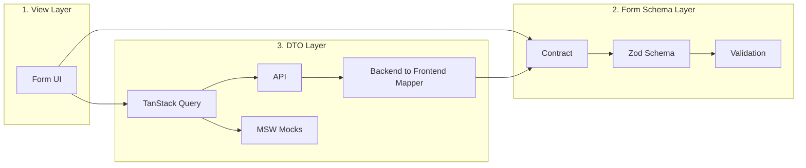

# Form Show Case

Showcase of form usage based on **Kaspersky Hexa UI** Design System. Demonstrates
real-world form patterns with validation, layout and multi-step flows.

Each form follows a **three-layer architecture**: View, Form Schema, and DTO. The common **Forma** layer (see [Forma README](./src/shared/Forma/README.md)) provides shared infrastructure; this README describes the **form-showcase app** layout and data flow.

---

## Architecture (form-showcase)



### Layer 1: View (Form UI)

- Form screen that composes **Forma** with a declarative config and submit handler. No direct RHF, Zod, or custom components.
- `<Forma<T> config={...} onSubmit={...} />` with optional `title`, `description`, `isLoading`, `renderActions`. Submission handler calls the DTO layer (e.g. mutation).
- **Location:** `app/forms/<FormName>/<FormName>.tsx`; form definition (data + UI) in `<FormName>.forma-config.ts`.

### Layer 2: Form Schema Layer

- Single source of truth for the form **contract**: types, validation rules, default values. No UI, no HTTP.
- Zod schema built **only** from Forma’s parameterized validators; resolver: `createFormaResolver(schema)`. Validators and i18n for default messages are documented in [Forma README](./src/shared/Forma/README.md).
- **Location:** `app/forms/<FormName>/<FormName>.forma-config.ts` (data: schema, types, defaults; UI: submitLabel, fields).

### Layer 3: DTO Layer

- Backend integration: API client (TanStack Query), MSW mocks, mapping between backend and form schema.
- **API:** GET (e.g. settings) via `useQuery`; submit via `useMutation` and Forma’s API client from `shared/Forma`.
- **Mapper:** backend DTO ↔ form schema (e.g. `apiProfileToFormValues`, `formValuesToLoginRequest`).
- **Location:** `app/forms/<Entity>/` — `Login.api.ts`, `Login.api.mock.ts`; API modules import from `shared/Forma`. Form types from `Login.forma-config.ts`.

### Data flow

**Load (e.g. Settings):** View → useQuery → API/MSW → backend DTO → mapper → form default values.

**Submit (e.g. Login):** User submits → validated form values → mutation → mapper → API/MSW → response.

### File layout (form-showcase)

```
src/
  main.tsx                  # Entry; MSW: initFormaMocks(handlers)
  main.css
  shared/
    Forma/                   # Common form layer — see Forma/README.md
  app/
    App.tsx                  # Router, layout; wrap content with FormaI18nInit inside ConfigProvider
    mocks/
      handlers.ts            # Aggregates MSW handlers from forms/*/Entity.api.mock
    pages/
      LoginPage.tsx, RegistrationPage.tsx, SettingsPage.tsx, WizardPage.tsx
    forms/
      Login/
        Login.forma-config.ts  # Layer 2: data (schema, types, defaults) + UI (FormaFormConfig)
        Login.api.ts         # Layer 3: DTO types, mappers, useMutation; imports from shared/Forma
        Login.api.mock.ts    # Layer 3: MSW handlers for this form's API
        Login.tsx            # Layer 1: form UI component (<Forma config={...} />)
      Registration/ ...
      Settings/ ...
      Wizard/ ...
```

**Validation message i18n:** Wrap app content with `<FormaI18nInit>` inside `ConfigProvider` so default validator messages use the same locale as hexa-ui. See [Forma README — Validation message internationalization](./src/shared/Forma/README.md#validation-message-internationalization-i18n).

---

## Tech stack

- **React 17** + **TypeScript**
- **Vite** — build and dev server
- **React Hook Form** — form state
- **Zod** — schema validation (with `@hookform/resolvers/zod`)
- **React Router v6** — navigation
- **@kaspersky/hexa-ui** — Field, Textbox, Select, Checkbox, etc.
- **react-i18next** — same version as hexa-ui for Forma validation i18n
- **TanStack Query** — mutations and settings GET
- **MSW** — client-side API mocks in dev. Run `npx msw init public/` once.

---

## Mocks vs real server

- **Dev default:** MSW on — `npm run dev`.
- **Real backend:** `VITE_MSW=false`; optionally `VITE_API_BASE=https://your-api.example.com`.
- **Production:** MSW never runs; use `VITE_API_BASE` if API is not at `/api`.

---

## Pages

| Route | Description |
|-------|-------------|
| **Login** | Email, password, "Remember me" with validation |
| **Registration** | Name, email, password confirmation, country Select, terms checkbox |
| **Settings** | Display name, language Select, notifications Toggle, theme Radio; FormGrid |
| **Multi-step Wizard** | Two steps (contact → company/role); step validation on Next |

---

## Run locally

```bash
cd examples/form-showcase
npm install
npm run dev
```

Open [http://localhost:5173](http://localhost:5173).

## Build

```bash
npm run build
```

Output in `dist/`. Preview: `npm run preview`.

## Lint

```bash
npm run lint
```
