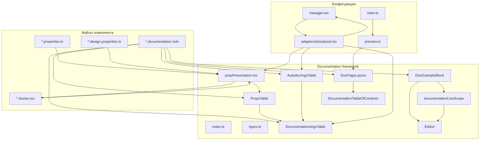

# Изменения относительно `HEAD`

Документ описывает diff относительно `HEAD`: для каждого файла явно указано — **добавлен**, **изменён**, **удалён** или **без изменений** (контекст для ревью). Предназначен для команды код-ревью.

## Область изменений

| Зона | Что затронуто |
|------|---------------|
| Storybook-инфраструктура | `.storybook/**` — layout, props tables, live editor, manager, конфиг |
| Документация компонентов | 8 компонентов переведены на новый формат docs/stories |
| Общие helpers | `helpers/resolveDesignControls.ts` — единый словарь presentation-метаданных |
| Runtime-компоненты | `Button`, `AnchorNavigation`, `Table`, `Tabs` — точечные правки для docs, типов и стабильности при unmount |
| Зависимости | `react-live`, `prism-react-renderer`, `@kaspersky/hexa-ui-icons`, `prettier` |

---

## 1. Изменения в `.storybook` (подробно)

### Обозначения

| Метка | Значение |
|-------|----------|
| **добавлен** | Файла не было в `HEAD`; создан с нуля |
| **изменён** | Файл существовал; перечислено только то, что поменялось |
| **удалён** | Файл был в `HEAD`; удалён |
| **без изменений** | Упомянуто только для контекста ревью — в diff не входит |

---

### 1.1 Корневые конфигурационные файлы

#### `.storybook/main.ts` — **изменён**

| | |
|---|---|
| **Изменено** | |
| | **Discovery stories** — glob `stories.` → `stories*`; путь `../src/**/*.…` заменён на `{ directory: '../src', files: '**/*.@(mdx\|stories*.@(ts\|tsx))' }` (подхватывает `Button.examples.stories.tsx`) |
| | **`typescript.reactDocgenTypescriptOptions`** — блок добавлен целиком: `propFilter`, enum literals, `skipChildrenPropWithoutDoc: false` |
| | **`viteFinal`** — добавлен `optimizeDeps.include: ['react-live', 'prism-react-renderer']` |
| | **`managerHead`** — CSS-хаки по generated class names (`.css-1wmxdc3` и т.д.) **заменены** на селектор `[data-item-id$="-stories"]` для скрытия component-иконки |
| **Без изменений** | `addons`, `refs`, `framework`, алиасы Vite (`@src`, `@design-system`, `@helpers`, `@sb`), less/scss preprocessor, `assetsInclude: '**/*.md'` |
| **Зачем** | Storybook находит новую файловую структуру docs; Autodoc извлекает нужные пропсы; live editor pre-bundle'ится; sidebar `Stories/` без лишней иконки |

---

#### `.storybook/preview.ts` — **изменён**

| | |
|---|---|
| **Изменено** | **`parameters.options.storySort`** — declarative `{ method: 'alphabetical', order: ['Intro', 'Changelog'] }` **заменён** на inline comparator-функцию: top-level order (`Intro` → … → `Hexa UI Components`), приоритет «Витрина компонентов», внутри title — `*Docs*` → `Playground` → остальное |
| **Без изменений** | `decorators` (`withI18n` → `withThemeProvider` → `withBadges`); `globalTypes` (`locale`, `theme`, `direction`); `parameters.docs` (`codePanel`, `source`); `parameters.controls` (exclude testing props, `expanded`, `sort`); `initialGlobals`; `tags: ['autodocs']` |
| **Зачем** | Sidebar отражает новую структуру «Docs → Playground → Stories», а не просто алфавитный порядок |

---

#### `.storybook/preview-body.html` — **изменён**

| | |
|---|---|
| **Изменено** | Добавлен CSS-блок для `.hexa-docs-editor.sb-unstyled` — monospace, 14px/20px на `pre`, `.token-line`, `textarea` |
| **Без изменений** | `html { font-family: "Kaspersky Sans Text", … }` |
| **Зачем** | Storybook Docs наследует 16px на вложенные элементы; без override editor ломает line numbers и MTR3 |

---

#### `.storybook/manager.tsx` — **изменён**

| | |
|---|---|
| **Изменено** | |
| | Imports — `storybook/internal/components` и `storybook/manager-api` **заменены** на `./adapters/storybook`; добавлен `FolderIcon` |
| | `addons.setConfig` — добавлены `layoutCustomisations.showPanel` (скрыть panel у `--documentation`) и `sidebar.renderLabel` (иконка папки для `*-stories`) |
| | Добавлена runtime-инъекция CSS `#kl-ui-kit-hide-controls-default-column` — скрывает колонки Control/Default в `.docblock-argstable`, перераспределяет ширины Name/Description |
| | Удалены неиспользуемые imports: `Key`, `AddonPanel`, `useParameter` |
| **Без изменений** | Toolbar addons: Versions, Build Info, Design Props toggle — логика та же |
| **Зачем** | Docs без нижней panel; ветка Stories визуально как папка; Properties table без controls-колонок |

---

#### `.storybook/kaspersky-theme.ts` — **изменён**

| | |
|---|---|
| **Изменено** | Import `create` из `storybook/theming` **заменён** на `createStorybookTheme` из `./adapters/storybook` |
| **Без изменений** | Значения темы: `base: 'light'`, шрифт, `brandTitle`, logo |
| **Зачем** | Локализация зависимости от Storybook theming API |

---

#### `.storybook/helpers.ts` — **изменён**

| | |
|---|---|
| **Изменено** | Тип `SBArgType`: import `Addon_ArgType` из `storybook/internal/types` **заменён** на `StorybookArgType` из adapter |
| **Без изменений** | Все helper-функции: `sbSetDefaultValue`, `sbHideControl`, `sbHideControls`, `PropsWithTooltip`, `sbFixArrayArgs`, `sbMergeActions` |
| **Зачем** | Убрать прямую зависимость stories от internal types |

---

### 1.2 Adapter

#### `.storybook/adapters/storybook.tsx` — **добавлен**

| | |
|---|---|
| **Что делает** | Единая точка импорта Storybook API, которые меняются между версиями |
| **Экспорты** | `StorybookManager`, `StorybookManagerUI`, `StorybookDocs`, `createStorybookTheme`, `StorybookArgType` |
| **Используется в** | `manager.tsx`, `kaspersky-theme.ts`, `helpers.ts`, `propPresentation.tsx`, `DocumentationArgsTable.tsx`, `AutodocArgsTable.tsx` |
| **Зачем** | При апгрейде Storybook править один файл |

---

### 1.3 `components/Documentation/` — framework документации

> Все файлы ниже — **добавлены** (папки `components/Documentation/` в `HEAD` не было).

#### `.storybook/components/Documentation/index.ts` — **добавлен**

Barrel: layout, editor, `DocumentationArgsTable`, `PropsTable`, `AutodocArgsTable`, presentation helpers, TOC util, types; экспорт `documentationLiveScope`, `mergeDocumentationLiveScope`, `buildPresentationOnlyRows`, `buildAutodocRows`.  
**Зачем:** импорт `@sb/components/Documentation` без знания внутренней структуры.

#### `.storybook/components/Documentation/types.ts` — **добавлен**

Типы `PropPresentation`, `PropPresentationMap`, `PropDefinitionSectionLabels`.  
**Зачем:** presentation-метаданные поверх Autodoc, без дублирования API компонента.

#### `.storybook/components/Documentation/DocumentationArgsTable.tsx` — **добавлен**

Единый UI для всех вкладок с таблицей пропов: `PureArgsTable` + тема Storybook (`DocumentationArgsTableWrapper`, `withRowNames`).  
Проп `rows` — уже подготовленные `ArgTypes`; проп `embedded` — тело таблицы без повторного `ThemeProvider` (несколько секций в `PropsTable`).  
**Зачем:** одна точка визуализации; подготовка данных остаётся во вкладко-специфичных билдерах.

#### `.storybook/components/Documentation/propPresentation.tsx` — **добавлен**

Helpers (`buildStoryArgTypes`, `getControlsInclude`, `getPropsTableRows`, `extendPropPresentation`, **`buildPresentationOnlyRows`**) + компонент **`PropsTable`** (рендер через `DocumentationArgsTable` с `embedded`).  
**`buildPresentationOnlyRows(presentation)`** — строки только из `PropPresentationMap`, без docgen (вкладка «Дизайнеру»).  
**Зачем:** один presentation-слой для Controls и Properties; отдельный пайплайн данных для design-only пропов.

#### `.storybook/components/Documentation/AutodocArgsTable.tsx` — **добавлен**

Обёртка над **`DocumentationArgsTable`**: собирает строки через экспортируемый **`buildAutodocRows`** (docgen → meta argTypes → supplemental presentation → testing props, `mergeMissingArgTypes`).  
**Зачем:** вкладка **autodoc** — полная выгрузка API кода; визуализация та же, что у Properties и «Дизайнеру».

**Разделение «данные ↔ UI» по вкладкам:**

| Вкладка | Подготовка `rows` | Рендер |
|---------|-------------------|--------|
| **Properties** | `getPropsTableRows(docgen, presentation)` внутри `PropsTable` | `DocumentationArgsTable` |
| **autodoc** | `buildAutodocRows({ of, presentation, includeTestingProps })` внутри `AutodocArgsTable` | `DocumentationArgsTable` |
| **Дизайнеру** | `buildPresentationOnlyRows(presentation)` в MDX | `DocumentationArgsTable` |

#### `.storybook/components/Documentation/DocPageLayout.tsx` — **добавлен**

Layout MDX-страниц: override Storybook Docs padding/TOC, темизация argstable, правая nav через `AnchorNavigation` + `MutationObserver`.  
**Зачем:** docs как продуктовая страница DS, а не стандартный Storybook canvas.

#### `.storybook/components/Documentation/DocPageHeader.tsx` — **добавлен**

Заголовок страницы (`H2`) + markdown description.  
**Зачем:** единый header на всех component docs.

#### `.storybook/components/Documentation/documentationLiveScope.ts` — **добавлен**

Базовый **react-live scope** для MDX-документации: `React`, barrel `@src/index`, все иконки `@kaspersky/hexa-ui-icons/16`, алиасы `Placeholder` / `PlaceholderComponent` (компонент vs иконка).  
`mergeDocumentationLiveScope(additional?)` — слияние с компонент-специфичным scope (фикстуры stories, локальные константы).  
**Зачем:** продуктовая специфика DS живёт на уровне documentation framework, а не внутри generic `Editor`.

#### `.storybook/components/Documentation/DocExampleBlock.tsx` — **добавлен**

Секция docs: title, description, live `Editor`, опциональный footer; props `previewDirection`, `previewGap`, `minHeight`, опциональный `scope` (дополнение к `documentationLiveScope`).  
Перед вызовом `Editor` собирает `mergeDocumentationLiveScope(scope)` и передаёт готовый объект в `LiveProvider`.  
**Зачем:** MDX собирается из повторно используемых блоков; автору не нужно импортировать весь Hexa UI в каждый пример.

#### `.storybook/components/Documentation/DocMarkdownDescription.tsx` — **добавлен**

Markdown renderer через DS `Markdown` (BTR3) + wrapper для абзацев.  
**Зачем:** описания пишутся markdown-строкой, не JSX.

#### `.storybook/components/Documentation/DocumentationTableOfContents.tsx` — **добавлен**

Util `collectDocumentationTocEntries(root)` — сбор `h3–h6`, slugify id, filter `.skip-toc`.  
**Зачем:** DOM-сканирование отделено от UI; nav рендерит `AnchorNavigation`.

---

### 1.4 `components/Documentation/Editor/` — live editor

> Все файлы — **добавлены**. Scope Hexa UI **не** входит в эту папку (см. `documentationLiveScope.ts` и `DocExampleBlock`).

| Файл | Назначение |
|------|------------|
| `Editor.tsx` | Live preview + code editor на `react-live` + `prism-react-renderer`; preview сверху, editor снизу; **обязательный** проп `scope` — только то, что передал вызывающий код |
| `editorCss.ts` | Styled-components оболочки; class `hexa-docs-editor sb-unstyled` |
| `liveCodeWrap.ts` | `unwrapDisplayCode` / `wrapForLive` — скрыть техническую обёртку react-live |
| `transformCode.ts` | Pre-transform в CJS перед исполнением (`render(<App />)`) |
| `useStorybookTextDirection.ts` | Hook: синхронизация `dir` preview с toolbar globals LTR/RTL |
| `index.ts` | Re-export `Editor`, `EditorProps` |

**Разделение ответственности (scope):**

| Слой | Файл | Что в scope |
|------|------|-------------|
| Generic editor | `Editor/` | Ничего продуктового — только UI react-live, тема, `transformCode`, layout preview |
| Documentation defaults | `documentationLiveScope.ts` | React, все компоненты DS, иконки 16px, алиас `Placeholder` |
| MDX / блок примера | `DocExampleBlock` | `mergeDocumentationLiveScope()` + опциональный `scope` с MDX |
| Компонент (исключения) | `src/<component>/stories/*DocScope.ts` | Фикстуры и данные только для этого компонента; в MDX — `scope={…}` на `DocExampleBlock` |

**Пример:** `CodeCompare.documentation.mdx` импортирует `codeCompareDocumentationScope` и передаёт `scope={codeCompareDocumentationScope}` на блоки с live-кодом (`codeCompareStoryVersions`, `codeCompareStoryOldValue`, …). Остальные компоненты достаточно базового scope из `DocExampleBlock`.

**Зачем:** интерактивные JSX-примеры в docs без явных import в тексте примера; `Editor` остаётся переиспользуемой обёрткой; тяжёлые или узкие данные не попадают в глобальный scope всех страниц.

---

### 1.5 Сопутствующие изменения в `.storybook`

#### `.storybook/components/Meta/withMeta.tsx` — **изменён**

| | |
|---|---|
| **Изменено** | `<StyledHeading>` — добавлен `className="skip-toc"` |
| **Без изменений** | Вся логика legacy autodocs page (Pixso link, DoD, markdown) |
| **Зачем** | Заголовок legacy page не попадает в правую AnchorNavigation |

#### `.storybook/decorators/withThemeProvider.tsx` — **изменён**

| | |
|---|---|
| **Изменено** | Добавлена ветка: при `parameters.layout === 'fullscreen'` story рендерится без `StoryLayoutContainer` |
| **Без изменений** | `ThemeProvider`, `GlobalStyle`, `StoryLayoutContainer` styling для обычных stories |
| **Зачем** | MDX docs с `DocPageLayout` не получают двойной padding от decorator |

---

### 1.6 Удалённые файлы

#### `.storybook/components/Documentation/propDefinitionsToArgTypes.ts` — **удалён**

| | |
|---|---|
| **Было** | Ручное преобразование `PropDefinition[]` → Storybook argTypes |
| **Заменено на** | react-docgen + `buildStoryArgTypes(presentation)` в `propPresentation.tsx` |
| **Зачем** | Убрать дублирование API; source of truth — TypeScript types |

---

### 1.7 Связи между модулями `.storybook`

**Поток данных для пропсов:**

1. TypeScript types компонента → react-docgen (`main.ts` options) → Autodoc argTypes
2. `*.properties.ts` (`PropPresentationMap`) → `buildStoryArgTypes` → Controls в Playground
3. Autodoc argTypes + presentation → `getPropsTableRows` → `PropsTable` → **`DocumentationArgsTable`** (Properties)
4. `buildAutodocRows` → **`AutodocArgsTable`** → **`DocumentationArgsTable`** (autodoc)
5. `*.design.properties.ts` → `buildPresentationOnlyRows` → **`DocumentationArgsTable`** (Дизайнеру, без docgen)

**Поток рендера docs-страницы:**

1. MDX → `DocPageLayout` (fullscreen, без story padding — `withThemeProvider`)
2. `DocPageHeader` + `Tabs` + `DocExampleBlock` → `mergeDocumentationLiveScope` (+ опциональный `scope` из MDX) → `Editor` → `react-live`
3. `MutationObserver` → `collectDocumentationTocEntries` → `AnchorNavigation` справа

---

## 3. Общий словарь presentation-метаданных

#### `helpers/resolveDesignControls.ts` — **изменён**

| | |
|---|---|
| **Изменено** | `shared` переименован и расширен в экспортируемый **`sharedPropConfig`**: для каждого общего пропа добавлены `group`, `control`, `deprecated`, описание |
| | Новые записи в словаре: `className`, `style`, `id`, `onClick`, `type`, `testId`, `theme`, legacy testing props (`klId`, `componentId`, `dataTestId`, `componentType`) |
| | Существующие (`children`, `disabled`, `loading`, `mode`, `size`, …) — дополнены `group` и `control` |
| **Без изменений** | `designControlsConfig` по компонентам; `withDesignControls` integration |
| **Зачем** | `*.properties.ts` переиспользуют базовые описания через `extendPropPresentation(sharedPropConfig[...])` |

#### `docs/props-as-is.md` — **добавлен**

Design note: схема работы с пропсами (Controls + Properties, роли файлов).  
**Зачем:** onboarding и референс для миграции следующих компонентов.

---

## 4. Миграция документации компонентов

> Для каждого компонента ниже: **добавлены** docs-файлы нового формата; корневой `*.stories.tsx` — **изменён** (упрощён до Playground).

### Эталонная структура на примере **Button**

**Порядок в Storybook** (новая структура навигации):

1. **Button Docs** — **добавлен** `Button.documentation.mdx`
2. **Playground** — **изменён** `Button.stories.tsx` (оставлена одна story)
3. **Stories/** — **добавлен** `Button.examples.stories.tsx`

| Файл | Статус | Что сделано |
|------|--------|-------------|
| `src/button/Button.stories.tsx` | **изменён** | Оставлен только `Playground`; добавлены `tags: ['!autodocs']`, `includeStories`; `argTypes` через `buildStoryArgTypes` |
| `src/button/stories/Button.examples.stories.tsx` | **добавлен** | Демо-сценарии (Mode, Size, Loading, …) вынесены из корневого stories |
| `src/button/stories/Button.documentation.mdx` | **добавлен** | Custom docs: `DocPageLayout`, вкладки, `DocExampleBlock`, `PropsTable`, `AutodocArgsTable`; вкладка **«Дизайнеру»** — `DocumentationArgsTable` + `buildPresentationOnlyRows`; **«Правила использования»** — гайдлайны из design spec (`variant`, семантика `mode`, `size` 40px, `state`, `loading`, иконки 16px) без дублирования существующих блоков |
| `src/button/stories/Button.design.properties.ts` | **добавлен** | `buttonDesignPropPresentation` — design-only пропы (`variant`, `mode`, `size`, `state`, …), соответствие имён Figma и кода |
| `src/button/stories/Button.properties.ts` | **добавлен** | `PropPresentationMap` для Controls и Properties |
| `src/button/SplitButton.stories.tsx` | **добавлен** | Отдельный entry в sidebar |
| `src/button/stories/SplitButton.documentation.mdx` | **добавлен** | Docs для SplitButton |
| `src/button/Button.tsx` | **изменён** | `SplitButton` — named export (был internal) |
| `src/button/types.ts` | **изменён** | `ButtonProps`: type alias → `interface extends TestingProps` (для docgen) |

**Особенности миграции по компонентам:**

| Компонент | Добавлено | Изменено | Удалено |
|-----------|-----------|----------|---------|
| **Accordion** | `*.documentation.mdx`, `*.examples.stories.tsx`, `*.properties.ts` | `Accordion.stories.tsx` перенесён на уровень компонента | `stories/Accordion.stories.tsx` |
| **Alert** | то же | `Alert.stories.tsx` перенесён на уровень компонента | `stories/Alert.stories.tsx` |
| **Badge** | docs + examples + properties | `Badge.stories.tsx` упрощён до Playground | — |
| **Button** | docs + examples + properties + **design.properties** + SplitButton entry | `Button.stories.tsx`, `Button.tsx`, `types.ts` | — |
| **Checkbox** | docs + examples + properties | `Checkbox.stories.tsx`; **без** `withDesignControls` | — |
| **Chip** | docs + examples + properties | `Chip.stories.tsx` | — |
| **Link** | docs + examples + properties | `Link.stories.tsx` | — |

---

## 5. Прочие изменения runtime и типов

#### `src/anchor-navigation/AnchorNavigation.tsx` — **изменён**

| | |
|---|---|
| **Изменено** | `probeY = scrollY + viewportHeight * 0.2` **заменён** на `scrollY + ACTIVE_SECTION_OFFSET` (24px) |
| **Зачем** | В docs-layout переключение активной секции в правой nav было слишком агрессивным |

#### `src/anchor-navigation/index.ts` — **изменён**

| | |
|---|---|
| **Изменено** | Добавлен re-export типа `AnchorItem` |
| **Зачем** | `DocPageLayout` импортирует тип через публичный barrel |

#### `src/table/modules/moduleTypes.ts` — **добавлен**

| | |
|---|---|
| **Добавлено** | Типы `TableComponent`, `TableModule` вынесены из `modules/index.tsx` |
| **Зачем** | Разорвать циклические импорты: модули больше не тянут runtime из barrel `index`, только `import type` |

#### `src/table/modules/index.tsx` — **изменён**

| | |
|---|---|
| **Изменено** | Определения `TableComponent` / `TableModule` удалены; добавлен re-export типов из `./moduleTypes` |
| **Без изменений** | `composeWithModules`, порядок и состав HOC-модулей |
| **Зачем** | Публичный API таблицы не меняется; упрощается сборка и `tsc` при правках modules |

#### Модули `src/table/modules/**` — **изменены** (15 файлов)

| | |
|---|---|
| **Изменено** | `import { TableComponent } from './index'` (или `'..'`) **заменён** на `import type { TableComponent } from './moduleTypes'` (или `'../moduleTypes'`) |
| **Затронуты** | `ColumnsSelection`, `ContextMenu`, `EmptyCellDash`, `ExpandableRows`, `Filters`, `Groups`, `InfiniteScroll`, `Initial`, `Pagination`, `Reductions`, `ResizableColumns`, `SidebarFilters`, `SortingAndFilters`, `ToolbarIntegration`, `Virtual` |
| **Без изменений** | Логика модулей, props, рендер |
| **Зачем** | Type-only импорт убирает цикл `index` ↔ модули без изменения поведения Table |

#### `src/tabs/Tabs.tsx` — **изменён**

| | |
|---|---|
| **Изменено** | |
| | `isMountedRef` — `setState` и измерения ширины только при смонтированном компоненте (переключение вкладок docs, `destroyInactiveTabPane`) |
| | Счётчик пересечения табов — функциональное обновление `(counter) => counter + 1` |
| | Обработчик `languageChanged` и `ResizeObserver` — очистка `setTimeout` / `cancelAnimationFrame` в cleanup |
| | Ширина контейнера — `requestAnimationFrame` вместо синхронного `setContainerWidth` в observer |
| | `TabsDropdown` рендерится только при `shouldShowMoreButton` |
| **Без изменений** | Публичные props, внешний API, значение по умолчанию `destroyInactiveTabPane = false` |
| **Зачем** | Убрать предупреждения React и гонки при быстром unmount (документация с вкладками, resize, смена locale) |

#### `src/markdown/markdownCss.ts` — **изменён**

| | |
|---|---|
| **Изменено** | Добавлен `p { getTextSizes(BTR3) }` внутри `StyledText` |
| **Зачем** | Единообразная типографика в `DocMarkdownDescription` |

#### `src/@types/assets/index.d.ts` — **изменён**

| | |
|---|---|
| **Изменено** | Добавлен `declare module '*.less'` |
| **Зачем** | TypeScript резолвит less-импорты в Storybook/Vite |

#### `docs/12-HexaUIComponents.mdx` — **добавлен**

Страница «Витрина компонентов» — каталог со ссылками на docs/stories.  
**Зачем:** точка входа в документацию из sidebar.

---

## 6. Зависимости (`package.json`) — **изменён**

| Пакет | Статус | Зачем |
|-------|--------|-------|
| `react-live` | **добавлен** (dev) | Live editor |
| `prism-react-renderer` | **добавлен** (dev) | Подсветка синтаксиса |
| `@kaspersky/hexa-ui-icons` | **добавлен** (dev) | `documentationLiveScope` (иконки в live-примерах) и story helpers |
| `prettier` | **добавлен** (dev) | Форматирование |

---

## Сводка по `.storybook`

| Статус | Файлы |
|--------|-------|
| **добавлены** (17) | `adapters/storybook.tsx`, `components/Documentation/**` (в т.ч. `DocumentationArgsTable.tsx`, `documentationLiveScope.ts`; без `Editor/editorScope.ts`), `Editor/useStorybookTextDirection.ts` |
| **изменены** (8) | `main.ts`, `preview.ts`, `preview-body.html`, `manager.tsx`, `helpers.ts`, `kaspersky-theme.ts`, `withMeta.tsx`, `withThemeProvider.tsx` |
| **удалены** (1) | `components/Documentation/propDefinitionsToArgTypes.ts` |
| **без изменений** | `decorators/withI18n.tsx`, `decorators/withBadges.tsx`, `components/designControls/**`, `StoryComponents.tsx`, `badges.tsx`, assets, остальные Meta/Links |

---

## Прочие новые файлы (вне `.storybook`)

| Файл | Статус |
|------|--------|
| `docs/12-HexaUIComponents.mdx` | **добавлен** |
| `docs/props-as-is.md` | **добавлен** |
| `docs/change-log.md` | **добавлен** |
| `src/<component>/stories/*.documentation.mdx` | **добавлен** (8 компонентов) |
| `src/<component>/stories/*.examples.stories.tsx` | **добавлен** |
| `src/<component>/stories/*.properties.ts` | **добавлен** |
| `src/button/stories/Button.design.properties.ts` | **добавлен** |
| `src/button/SplitButton.stories.tsx` | **добавлен** |
| `src/table/modules/moduleTypes.ts` | **добавлен** |

---

## Удалённые или заменённые файлы

| Файл | Причина |
|------|---------|
| `.storybook/components/Documentation/propDefinitionsToArgTypes.ts` | Ручная сборка argTypes заменена на Autodoc + presentation-map |
| `src/accordion/stories/Accordion.stories.tsx` | Stories перенесены: Playground → `Accordion.stories.tsx`, examples → `stories/Accordion.examples.stories.tsx` |
| `src/alert/stories/Alert.stories.tsx` | Аналогично Accordion |

---

## Итог для ревью

1. **Storybook** получил отдельную documentation infrastructure: кастомный layout, **`DocumentationArgsTable`** как единый рендер таблиц пропов (Properties / autodoc / Дизайнеру с разными билдерами `rows`), live editor (без продуктового scope внутри `Editor/`), базовый react-live scope в `documentationLiveScope.ts`, adapter для internal API.
2. **8 компонентов** (Accordion, Alert, Badge, Button, SplitButton, Checkbox, Chip, Link) переведены на единый формат docs — эталон описан на примере Button; у Button заполнены вкладки **«Дизайнеру»** (design properties) и расширены **«Правила использования»**.
3. **Props documentation и Controls** опираются на TypeScript/react-docgen как source of truth; presentation-схема в `*.properties.ts` задаёт только отображение.
4. **Manager и sidebar** подстроены под новую навигацию: docs без panel, Stories как папка, предсказуемый sort order.
5. **Точечные runtime-правки** (`AnchorNavigation`, `SplitButton` export, `AnchorItem` re-export) обслуживают docs; **`Table`** — только рефакторинг type-only импортов модулей; **`Tabs`** — защита от `setState` после unmount при вкладках docs и resize/locale, без смены публичного API.
